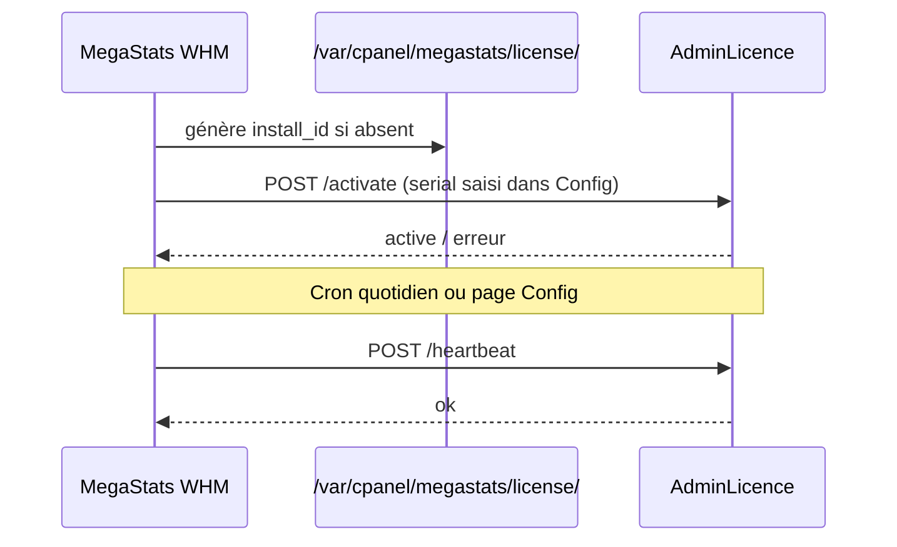

# MegaStats × AdminLicence — numéro de série et comptage des installations

**Statut :** spécification (non implémentée dans MegaStats v3.2.0)  
**Objectif :** garder MegaStats **auto-hébergé** comme aujourd’hui, et compter **exactement** le nombre d’installations actives via **AdminLicence** + un **serial** par serveur.

---

## Principe

| Sans serial | Avec serial AdminLicence |
|-------------|--------------------------|
| MegaStats fonctionne normalement (monitoring, mail, toolkit, MAJ Git) | Idem + enregistrement côté AdminLicence |
| Aucun appel réseau vers OBI2 | Heartbeat périodique vers l’API AdminLicence |
| Non compté dans les stats | **1 serial = 1 installation** (dédupliquée par `install_id`) |

Le compteur « X installations » du README vient directement d’**AdminLicence**, pas d’un guess GitHub.

---

## Fichiers prévus (MegaStats)

### `config/license.php`

```php
<?php

return [
    // Vide = mode communautaire (pas de heartbeat)
    'license_serial' => '',

    // URL API AdminLicence (prod OBI2)
    'license_api_url' => 'https://adminlicence.obi2.net/api/v1',

    // Heartbeat : 1 = activé si serial renseigné
    'license_heartbeat_enabled' => true,

    // Intervalle minimum entre deux heartbeats (secondes)
    'license_heartbeat_interval' => 86400, // 24 h
];
```

### Identifiant d’installation local

Fichier créé à la première activation (jamais le hostname en clair) :

```
/var/cpanel/megastats/license/install_id   # UUID v4, chmod 600
```

---

## API AdminLicence (côté serveur OBI2)

Base URL exemple : `https://adminlicence.obi2.net/api/v1`

### 1. Activation du serial

```http
POST /megastats/activate
Content-Type: application/json

{
  "serial": "MS-XXXX-XXXX-XXXX",
  "install_id": "550e8400-e29b-41d4-a716-446655440000",
  "product": "megastats",
  "version": "3.2.0",
  "hostname_hash": "sha256:abc…"   // hash(hostname), pas le FQDN
}
```

**Réponse 200 :**

```json
{
  "ok": true,
  "status": "active",
  "expires_at": "2027-06-24T00:00:00Z",
  "label": "Client OBI2 — serv.example"
}
```

**Erreurs :** `invalid_serial`, `serial_already_used`, `expired`, `revoked`.

### 2. Heartbeat (comptage des installs actives)

```http
POST /megastats/heartbeat
Content-Type: application/json

{
  "serial": "MS-XXXX-XXXX-XXXX",
  "install_id": "550e8400-e29b-41d4-a716-446655440000",
  "version": "3.2.0"
}
```

AdminLicence :

- met à jour `last_seen_at` pour ce couple `serial` + `install_id`
- considère **active** si `last_seen_at` < 30 jours (paramétrable)

### 3. Badge Shields.io (README GitHub)

```http
GET /megastats/badge.json
```

Réponse (format [Shields endpoint](https://shields.io/blogs/endpoint-badge)) :

```json
{
  "schemaVersion": 1,
  "label": "installations",
  "message": "47",
  "color": "blue"
}
```

`message` = nombre d’installations **actives** (heartbeats récents + serial valide).

Dans le README :

```markdown

```

---

## Flux côté MegaStats (à coder)



### Points d’accroche prévus

| Moment | Action |
|--------|--------|
| `whm/install.sh` | Ne rien envoyer (serial saisi plus tard dans WHM) |
| Page **Configuration → Licence** | Saisie serial, bouton « Activer » |
| `cron.php` (1×/jour) | Heartbeat si serial + `license_heartbeat_enabled` |
| `update.sh` / MAJ web | Heartbeat avec nouvelle `version` |

### Page WHM Configuration

- Champ **Numéro de série**
- Statut : `Non activé` / `Actif jusqu’au …` / `Expiré` / `Révoqué`
- Boutons : **Activer**, **Vérifier**, **Désactiver** (efface le serial local, pas la ligne AdminLicence)

---

## Comptage exact : règles AdminLicence

Pour un chiffre fiable :

1. **Une ligne par `install_id`** (UUID stable sur le serveur).
2. **Un serial** peut être lié à une seule `install_id` (sauf migration documentée).
3. **Active** = heartbeat reçu dans les **30 derniers jours**.
4. **Total installations** affiché = `COUNT(*) WHERE status = active`.
5. Désinstallation : pas de heartbeat → sort du compteur après 30 jours (ou webhook « désactiver » futur).

Requête SQL indicative :

```sql
SELECT COUNT(DISTINCT install_id)
FROM megastats_installations
WHERE product = 'megastats'
  AND status = 'active'
  AND last_seen_at >= NOW() - INTERVAL 30 DAY;
```

---

## Ce qui ne change pas

- Clone GitHub, `./whm/update.sh`, MIT
- Données métriques / mail **100 % locales**
- Pas de serial → **aucun** appel AdminLicence (comportement actuel)

---

## Confidentialité

Voir [PRIVACY.md](PRIVACY.md). Avec serial activé, MegaStats envoie uniquement :

- `serial`, `install_id`, `version`, `hostname_hash` (hash one-way)

Pas de liste de comptes cPanel, pas de métriques, pas d’IP publique obligatoire.

---

## Checklist implémentation (v3.3+)

- [ ] `config/license.php` + entrée éditeur Config WHM
- [ ] `includes/license/client.php` (activate, heartbeat, cache statut)
- [ ] `includes/license/page.php` ou section dans config editor
- [ ] Hook cron quotidien
- [ ] Endpoints AdminLicence : `activate`, `heartbeat`, `badge.json`
- [ ] Badge Shields.io dans README
- [ ] Tests : serial invalide, expiré, double activation, reprise après MAJ

---

## Contact / AdminLicence

Configurer l’URL API et les serials dans **AdminLicence** (back-office OBI2).  
Support MegaStats : `support_email` dans `config/distribution.php`.
