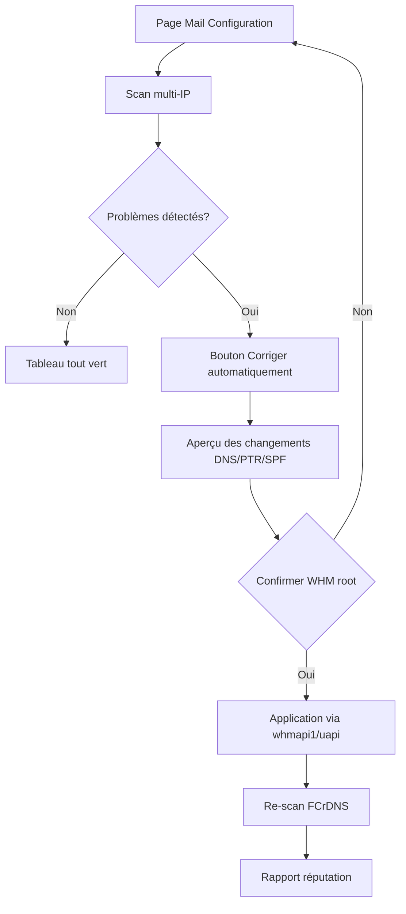

# MegaStats v4.0 — Mail Configuration (roadmap)

**Statut :** spécification / évolution planifiée — **aucun code implémenté**  
**Version cible :** 4.0.0  
**Module parent :** [Mail & délivrabilité](README.md) (v3.x — RBL, score, scan DNS existants)

---

## Contexte

MegaStats v3 affiche déjà une page **Mail & délivrabilité** solide : score global, RBL (30 zones), SPF, DKIM, DMARC, PTR, Microsoft SNDS (stub), liste d’IP cliquables, rapports e-mail.

**Limitation actuelle :** les contrôles DNS sont surtout **centrés sur le domaine principal** et une IP « active ». Sur un serveur avec **plusieurs IP d’envoi** (dédiées, rotation Exim, IP revendeur), l’administrateur doit vérifier manuellement chaque IP.

**Objectif v4 :** une section **« Mail Configuration »** — tableau multi-IP + actions de correction assistées.

---

## Maquette UI (WHM)

Nouvel onglet ou bloc sous **Délivrabilité Email & IP** :

```
┌─────────────────────────────────────────────────────────────────────────────┐
│  Mail Configuration                                    [Corriger auto ▼]   │
│  Domaine : example.com · Zone DNS : example.com · Dernière vérif : 14:32   │
├──────────┬──────┬───┬─────┬──────┬───────┬────────┬───────────┬──────────┤
│ IP       │ PTR  │ A │ SPF │ DKIM │ DMARC │ FCrDNS │ Microsoft │ Actions  │
├──────────┼──────┼───┼─────┼──────┼───────┼────────┼───────────┼──────────┤
│ 54.36…161│  ✅  │ ✅ │ ✅  │  ✅  │  ✅   │   ✅   │    🟢     │ Détail   │
│ 54.36…163│  ✅  │ ✅ │ ✅  │  ✅  │  ✅   │   ✅   │    🟢     │ Détail   │
│ 54.36…165│  ❌  │ ✅ │ ⚠️  │  ✅  │  ✅   │   ❌   │    🟡     │ Corriger │
└──────────┴──────┴───┴─────┴──────┴───────┴────────┴───────────┴──────────┘

Légende : ✅ OK · ⚠️ Partiel / warning · ❌ KO · 🟢 🟡 🔴 réputation Microsoft
```

**Interactions :**

- Clic sur une **IP** → panneau détail (comme RBL v3) + historique par IP
- Clic sur une **cellule** → explication + commande / enregistrement attendu
- **Corriger automatiquement** (global ou par ligne) → assistant guidé (voir ci-dessous)
- **Exporter** → PDF / e-mail (extension du rapport quotidien v3)

---

## Colonnes du tableau

| Colonne | Définition | Source v3 réutilisable |
|---------|------------|------------------------|
| **IP** | IP d’envoi Exim / liste `mail_sending_ips` / IP dédiées cPanel | Partiel (`mail_sending_ips`, détection IP scan) |
| **PTR** | rDNS : `IP → hostname` cohérent avec la politique OBI2 | `ms_mail_check_ptr()` |
| **A** | Enregistrement **A** du hostname mail (`mail-rN.domain`) → cette IP | **Nouveau** |
| **SPF** | Présence de l’IP dans le TXT `v=spf1` du domaine | `ms_mail_check_spf()` + parsing par IP |
| **DKIM** | Sélecteur actif pour le domaine (souvent commun à toutes les IP) | `ms_mail_check_dkim()` |
| **DMARC** | `_dmarc.domain` publié | `ms_mail_check_dmarc()` |
| **FCrDNS** | *Forward-confirmed reverse DNS* : PTR(IP)=H **et** A(H)=IP | **Nouveau** (compose PTR + A) |
| **Microsoft** | Réputation Outlook / SNDS / blocage | `ms_mail_check_microsoft_snds()` → API réelle v4 |

### FCrDNS (détail)

Pour chaque IP :

1. `PTR(54.36.246.161)` → `mail-r1.example.com`
2. `A(mail-r1.example.com)` → doit retourner `54.36.246.161`
3. Si les deux concordent → **FCrDNS ✅**

C’est le critère le plus fiable pour la délivrabilité chez Microsoft et Gmail.

---

## Bouton « Corriger automatiquement »

Action **assistée** (pas magique) : MegaStats propose et applique ce qui est **automatisable via cPanel/WHM**, avec **aperçu + confirmation** avant écriture DNS.

### Étape 1 — Inventaire

- Lister les IP d’envoi (`/etc/mailips`, `whmapi1 listips`, comptes avec IP dédiée)
- Associer chaque IP à un hostname cible : `mail-r1`, `mail-r2`, `mail-r3`… sur le domaine principal ou domaine dédié envoi
- Détecter la zone DNS authoritative (cPanel Zone Editor / PowerDNS)

### Étape 2 — Création DNS (mail-r1, mail-r2, mail-r3…)

Pour chaque IP sans enregistrement cohérent :

| Enregistrement | Type | Valeur |
|----------------|------|--------|
| `mail-r1.example.com` | **A** | `54.36.246.161` |
| `mail-r1.example.com` | **PTR** | via WHM « Configure PTR » (datacenter / ARPA) |
| (optionnel) | **AAAA** | si IPv6 |

**API cPanel envisagée :**

- `uapi --user=… Zone edit add_zone_record` ou `whmapi1 addzonerecord`
- WHM : `whmapi1 set_reverse_dns` / interface IP → PTR (selon hébergeur)

### Étape 3 — Vérification FCrDNS

- Re-scan DNS après TTL minimal (ou force cache flush local)
- Marquer la ligne ✅ uniquement si boucle PTR ↔ A validée

### Étape 4 — SPF (fusion intelligente)

- Lire le TXT SPF existant
- Ajouter `ip4:54.36.246.161` (et les autres IP) **sans dupliquer**
- Respecter la limite 10 lookups / longueur TXT (split si `spf.mail.example.com`)

### Étape 5 — DKIM / DMARC

| Élément | Auto-fix |
|---------|----------|
| **DKIM** | Activer DKIM cPanel (`/usr/local/cpanel/bin/dkim_keys_install`) + publier TXT si absent |
| **DMARC** | Proposer politique par défaut : `v=DMARC1; p=none; rua=mailto:dmarc@domain` (modifiable) |

### Étape 6 — Rapport de réputation

Générer un rapport consolidé (HTML + e-mail) :

- Tableau Mail Configuration (snapshot)
- RBL par IP (réutiliser v3)
- Score par IP + score domaine
- Microsoft SNDS / recommandations
- Actions effectuées + actions manuelles restantes (PTR côté provider si hors WHM)

---

## Flux utilisateur



---

## Architecture technique (v4)

### Nouveaux fichiers prévus

```
includes/mail/
  multi-ip.php          # Inventaire IP + hostname mail-rN
  fcrdns.php            # Vérification forward-confirmed rDNS
  dns-fix.php           # Propositions + application zone DNS
  ptr-fix.php           # Assistant PTR WHM
  reputation-report.php # Rapport consolidé

templates/mail/
  configuration.php     # Tableau principal
  configuration-row.php # Ligne IP (partiel)
  fix-preview.php       # Modal / page confirmation
```

### Config (`config/mail.php` — extensions)

```php
// Préfixe hostnames envoi : mail-r1, mail-r2…
'mail_hostname_prefix' => 'mail-r',
'mail_hostname_domain' => '', // vide = domaine principal détecté
'mail_auto_fix_enabled' => true,
'mail_auto_fix_ptr' => true,   // false si PTR géré chez OVH/etc.
'mail_auto_fix_spf' => true,
'mail_auto_fix_dkim' => true,
'mail_auto_fix_dmarc' => true,
'mail_fcrdns_required' => true,
```

### Données persistées

```
/var/cpanel/megastats/mail/
  configuration/latest.json    # Dernier scan multi-IP
  configuration/history/       # Historique par jour
  fixes/                       # Journal des corrections appliquées
```

---

## Microsoft — colonne dédiée

**v3 :** stub SNDS (clé config, pas d’API live).

**v4 :**

| Niveau | Affichage | Source |
|--------|-----------|--------|
| 🟢 | OK / faible plainte | API SNDS ou Smart Network Data |
| 🟡 | Plaintes / seuil | SNDS CSV / API |
| 🔴 | Blocklist / S3150 | SNDS + test SMTP Outlook |
| ⚪ | Non configuré | Lien portail + champ clé dans Config |

Option : test SMTP `telnet` / `swaks` vers `outlook-com.olc.protection.outlook.com` pour compléter SNDS.

---

## Sécurité et garde-fous

- **WHM root only** — comme le reste du module mail
- **Confirmation obligatoire** avant toute écriture DNS (SweetAlert2 / page dédiée)
- **Journal d’audit** : qui, quand, quels enregistrements (JSON local)
- **Rollback** : sauvegarde zone DNS avant modification (export zone cPanel)
- **PTR** : si le datacenter ne permet pas l’API PTR, afficher instructions manuelles (pas d’échec silencieux)
- **Idempotence** : ne pas recréer `mail-r1` si déjà correct

---

## Phases de livraison

| Phase | Version | Contenu |
|-------|---------|---------|
| **4.0-alpha** | 4.0.0-a | Tableau multi-IP read-only (PTR, A, SPF, DKIM, DMARC, FCrDNS, Microsoft) |
| **4.0-beta** | 4.0.0-b | Bouton « Corriger » : A + SPF + DMARC via Zone Editor |
| **4.0** | 4.0.0 | PTR assisté + rapport réputation + export PDF/e-mail |
| **4.1** | 4.1.0 | API Microsoft SNDS complète, Google Postmaster hint, tests inbox multi-IP |

---

## Relation avec les autres roadmaps

| Document | Lien |
|----------|------|
| [ADMINLICENCE.md](ADMINLICENCE.md) | Option premium : auto-fix avancé ou quota de corrections |
| Module Mail v3 | Base scans, RBL, score — réutilisée, pas remplacée |
| Server Toolkit | Scripts SSH `exim-status`, `dns-status` en complément |

---

## Critères d’acceptation v4.0

- [ ] Tableau affiche **toutes** les IP d’envoi configurées (min. 3 IP type OBI2)
- [ ] Colonnes PTR, A, SPF, DKIM, DMARC, FCrDNS, Microsoft avec icônes ✅ / ⚠️ / ❌
- [ ] FCrDNS calculé correctement (test unitaire sur IP fictive)
- [ ] « Corriger automatiquement » crée `mail-r1`, `mail-r2`, `mail-r3` + A records sans casser SPF existant
- [ ] Re-scan post-correction met à jour le tableau sous 60 s
- [ ] Rapport réputation exportable (HTML + option e-mail)
- [ ] Aucune modification DNS sans confirmation root explicite
- [ ] Documentation WHM + entrée CHANGELOG 4.0.0

---

## Exemple de rendu cible (texte)

```
IP              PTR   A   SPF  DKIM  DMARC  FCrDNS  Microsoft
54.36.246.161   ✅    ✅   ✅    ✅     ✅      ✅       🟢
54.36.246.163   ✅    ✅   ✅    ✅     ✅      ✅       🟢
54.36.246.165   ✅    ✅   ✅    ✅     ✅      ✅       🟢
```

---

## Notes OBI2 / hébergement mutualisé dédié

Scénario typique (comme `serv.obi2.net`) :

- Pool d’IP dédiées pour l’envoi sortant
- Hostnames `mail-r1.domain.tld` … `mail-rN.domain.tld`
- PTR gérés côté panel ou ticket provider
- SPF unique incluant toutes les `ip4:`
- **DNS local PowerDNS** (`pdns`) sur cPanel — le toolkit v3.2.2+ le détecte correctement (plus de faux « named inactif »)

Cette fonctionnalité v4 vise exactement ce cas d’usage — aujourd’hui laborieux sans outil centralisé dans WHM.

---

*Document rédigé juin 2026 — MegaStats v4.0 roadmap, sans implémentation code.*
