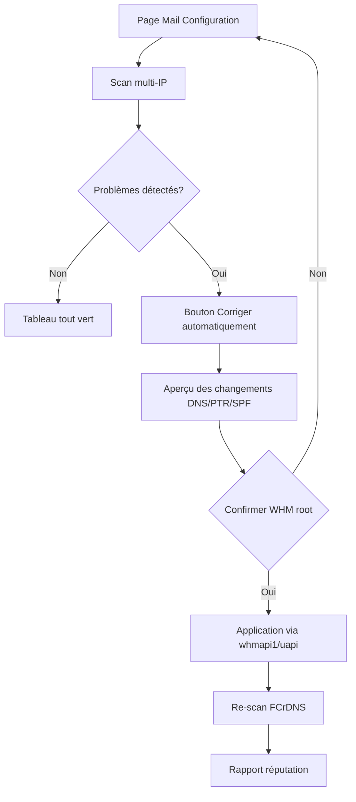

# MegaStats v4.0 — Mail Configuration (roadmap)

**Statut :** spécification / évolution planifiée — **aucun code implémenté**  
**Version cible :** 4.0.0  
**Module parent :** [Mail & délivrabilité](README.md) (v3.x — RBL, score, scan DNS existants)

---

## Contexte

MegaStats v3 affiche déjà une page **Mail & délivrabilité** solide : score global, RBL (30 zones), SPF, DKIM, DMARC, PTR, Microsoft SNDS (stub), liste d’IP cliquables, rapports e-mail.

**Limitation actuelle :** les contrôles DNS sont surtout **centrés sur le domaine principal** et une IP « active ». Sur un serveur avec **plusieurs IP d’envoi** (dédiées, rotation Exim, IP revendeur), l’administrateur doit vérifier manuellement chaque IP.

**Objectif v4 :** une section **« Mail Configuration »** — tableau multi-IP avec indicateurs ✅ / ❌, contrôles automatiques à chaque ajout de compte ou d’IP, et actions de correction assistées.

### Checklist automatique par IP (cœur v4)

Pour **chaque IP d’envoi**, le plugin vérifie sans intervention manuelle :

| # | Contrôle | Colonne tableau |
|---|----------|-----------------|
| 1 | PTR configuré sur l’IP | **PTR** |
| 2 | Le PTR pointe vers un nom d’hôte valide | **PTR** (détail) |
| 3 | Ce nom possède un enregistrement **A** | **A** |
| 4 | L’enregistrement **A** revient vers la **même IP** (FCrDNS) | **FCrDNS** |
| 5 | L’IP est **assignée à un compte cPanel** | **Compte** (nouveau) |
| 6 | Option cPanel **« Send mail from the account's IP address »** activée | **Mail IP** (nouveau) |
| 7 | **SPF**, **DKIM** et **DMARC** valides pour le domaine | **SPF** · **DKIM** · **DMARC** |
| 8 | Réputation **RBL** (alignée MXToolbox, voir section dédiée) | **RBL** (nouveau) |

Sources cPanel prévues : `whmapi1 listaccts` / `accountsummary`, fichier `/var/cpanel/users/`, metadata `IP=` et `SENDER=`, option Exim **account IP** (`/etc/mailips`, `senderverify`).

---

## Maquette UI (WHM)

Nouvel onglet ou bloc sous **Délivrabilité Email & IP** :

```
┌─────────────────────────────────────────────────────────────────────────────┐
│  Mail Configuration                                    [Corriger auto ▼]   │
│  Domaine : example.com · Zone DNS : example.com · Dernière vérif : 14:32   │
├──────────┬──────┬───┬─────┬──────┬───────┬────────┬────────┬─────────┬───────────┬──────────┤
│ IP       │ PTR  │ A │ SPF │ DKIM │ DMARC │ FCrDNS │ Compte │ Mail IP │ RBL       │ Microsoft│
├──────────┼──────┼───┼─────┼──────┼───────┼────────┼────────┼─────────┼───────────┼──────────┤
│ 54.36…161│  ✅  │ ✅ │ ✅  │  ✅  │  ✅   │   ✅   │ user1  │   ✅    │ 1 🟡      │    🟢    │
│ 54.36…163│  ✅  │ ✅ │ ✅  │  ✅  │  ✅   │   ✅   │ user2  │   ✅    │ 0 🟢      │    🟢    │
│ 54.36…165│  ❌  │ ✅ │ ⚠️  │  ✅  │  ✅   │   ❌   │ —      │   ❌    │ 6 🔴      │    🟡    │
└──────────┴──────┴───┴─────┴──────┴───────┴────────┴────────┴─────────┴───────────┴──────────┘

Légende : ✅ OK · ⚠️ Partiel / warning · ❌ KO · 🟢 🟡 🔴 réputation Microsoft
```

**Interactions :**

- Clic sur une **IP** → panneau détail (comme RBL v3) + historique par IP
- Clic sur une **cellule** → explication + commande / enregistrement attendu
- **Corriger automatiquement** (global ou par ligne) → assistant guidé (voir ci-dessous)
- **Exporter** → PDF / e-mail (extension du rapport quotidien v3)

---

## Colonnes du tableau

| Colonne | Définition | Source v3 réutilisable |
|---------|------------|------------------------|
| **IP** | IP d’envoi Exim / liste `mail_sending_ips` / IP dédiées cPanel | Partiel (`mail_sending_ips`, détection IP scan) |
| **PTR** | rDNS : `IP → hostname` cohérent avec la politique OBI2 | `ms_mail_check_ptr()` |
| **A** | Enregistrement **A** du hostname mail (`mail-rN.domain`) → cette IP | **Nouveau** |
| **SPF** | Présence de l’IP dans le TXT `v=spf1` du domaine | `ms_mail_check_spf()` + parsing par IP |
| **DKIM** | Sélecteur actif pour le domaine (souvent commun à toutes les IP) | `ms_mail_check_dkim()` |
| **DMARC** | `_dmarc.domain` publié | `ms_mail_check_dmarc()` |
| **FCrDNS** | *Forward-confirmed reverse DNS* : PTR(IP)=H **et** A(H)=IP | **Nouveau** (compose PTR + A) |
| **Compte** | IP dédiée liée à un utilisateur cPanel (`IP=` dans userdata) | **Nouveau** |
| **Mail IP** | « Send mail from the account's IP address » activé pour ce compte | **Nouveau** (`whmapi1` / Exim mailips) |
| **RBL** | Détail par sous-liste + regroupement par **famille** (Spamhaus zen/PBL/SBL/XBL…) | v3 `ms_mail_check_rbl()` — **conserver les sous-listes** |
| **Microsoft** | Réputation Outlook / SNDS / blocage | `ms_mail_check_microsoft_snds()` → API réelle v4 |

### FCrDNS (détail)

Pour chaque IP :

1. `PTR(54.36.246.161)` → `mail-r1.example.com`
2. `A(mail-r1.example.com)` → doit retourner `54.36.246.161`
3. Si les deux concordent → **FCrDNS ✅**

C’est le critère le plus fiable pour la délivrabilité chez Microsoft et Gmail.

---

## Score global /100 (style SSL Labs)

### État v3 (déjà en place)

MegaStats v3 calcule déjà un **score /100** (`ms_mail_compute_score`) affiché sur la page Mail :

- Pénalités DNS : SPF, DKIM, DMARC, PTR (−12 chacun si KO)
- Pénalités SMTP : banner, HELO, TLS (−8 chacun si KO)
- Pénalités RBL : −10 par liste (−40 max)
- SpamAssassin, tests MX

### Évolution v4 (pertinent — à enrichir)

| Amélioration v4 | Intérêt |
|-----------------|--------|
| **Score par IP** + score serveur global | Comme SSL Labs : note par « hôte » + synthèse |
| **Grades A+ à F** | Lecture instantanée (ex. ≥90 A, ≥70 B…) |
| **Détail des points perdus** | « −12 DMARC manquant », « −20 Spamhaus (critique) » |
| **Poids RBL par impact** | UCEProtect L3 / Spamhaus SBL = critique ; listes mineures = faible |
| **FCrDNS** dans le calcul | −15 si FCrDNS KO (v4) |

**Verdict :** le score /100 **existe** ; la version « SSL Labs » (grades, score par IP, pondération intelligente) est **pertinente v4** et pas encore faite.

---

## RBL : sous-listes, familles et niveau d’impact

### Politique produit (décision OBI2)

**Conserver l’affichage des sous-listes** (zen, PBL, SBL, XBL, UCEProtect L1/L2/L3…) — détail technique utile pour le diagnostic. Pas de suppression au profit d’un seul `zen`.

En **plus**, v4 ajoute un **regroupement visuel par famille** :

```
▼ Spamhaus (4 sous-listes listées)     Impact : CRITIQUE
    zen.spamhaus.org      LISTED
    pbl.spamhaus.org      LISTED
    sbl.spamhaus.org      LISTED
    xbl.spamhaus.org      LISTED

▼ UCEProtect (1 sous-liste)              Impact : CRITIQUE
    dnsbl-3.uceprotect.net  LISTED

▶ Spamcop (0)                            Impact : Important — OK
```

### Niveaux d’impact (v4)

| Niveau | Exemples | Effet délivrabilité |
|--------|----------|---------------------|
| **Critique** | Spamhaus (zen/SBL/XBL), UCEProtect L2/L3, CBL, Barracuda | Blocage fréquent Gmail/Outlook |
| **Important** | Spamcop, SORBS, PSBL | Filtres agressifs |
| **Informatif** | UCEProtect L0/L1, listes régionales, RHSBL | Contexte ; L3 entraîne souvent L1/L2 |

Le **compteur** affiche : `6 listées · 2 familles critiques` (sous-listes + synthèse).

### MXToolbox vs MegaStats

MXToolbox agrège l’affichage ; MegaStats montre **plus de détail** (sous-listes). Les deux peuvent être cohérents si UCEProtect L3 est listée des deux côtés. L’écart « 1 vs 6 » vient du **niveau de détail Spamhaus**, pas d’une erreur de détection.

### Performance v4

Scan 47 zones ≈ 113 s en v3 — **paralléliser** les requêtes DNS ou cache court par zone (TTL 5 min).

---

## Contrôles mail : état v3 vs v4

| Contrôle | v3 | v4 |
|----------|----|----|
| **PTR** | ✅ `ms_mail_check_ptr()` (IP principale) | ✅ Par IP + hostname mail-rN |
| **FCrDNS** | ❌ | ✅ Nouveau |
| **SPF** | ✅ domaine | ✅ + IP dans le SPF |
| **DKIM** | ✅ | ✅ par domaine / compte |
| **DMARC** | ✅ | ✅ |
| **HELO** | ✅ probe SMTP EHLO (`mail_helo_name`) | ✅ + cohérence HELO = hostname FCrDNS |
| **Score /100** | ✅ basique | ✅ enrichi (grades, par IP) |
| **RBL familles + impact** | ❌ liste plate | ✅ v4 |

---

## Bouton « Corriger automatiquement »

Action **assistée** (pas magique) : MegaStats propose et applique ce qui est **automatisable via cPanel/WHM**, avec **aperçu + confirmation** avant écriture DNS.

### Étape 1 — Inventaire

- Lister les IP d’envoi (`/etc/mailips`, `whmapi1 listips`, comptes avec IP dédiée)
- Associer chaque IP à un hostname cible : `mail-r1`, `mail-r2`, `mail-r3`… sur le domaine principal ou domaine dédié envoi
- Détecter la zone DNS authoritative (cPanel Zone Editor / PowerDNS)

### Étape 2 — Création DNS (mail-r1, mail-r2, mail-r3…)

Pour chaque IP sans enregistrement cohérent :

| Enregistrement | Type | Valeur |
|----------------|------|--------|
| `mail-r1.example.com` | **A** | `54.36.246.161` |
| `mail-r1.example.com` | **PTR** | via WHM « Configure PTR » (datacenter / ARPA) |
| (optionnel) | **AAAA** | si IPv6 |

**API cPanel envisagée :**

- `uapi --user=… Zone edit add_zone_record` ou `whmapi1 addzonerecord`
- WHM : `whmapi1 set_reverse_dns` / interface IP → PTR (selon hébergeur)

### Étape 3 — Vérification FCrDNS

- Re-scan DNS après TTL minimal (ou force cache flush local)
- Marquer la ligne ✅ uniquement si boucle PTR ↔ A validée

### Étape 4 — SPF (fusion intelligente)

- Lire le TXT SPF existant
- Ajouter `ip4:54.36.246.161` (et les autres IP) **sans dupliquer**
- Respecter la limite 10 lookups / longueur TXT (split si `spf.mail.example.com`)

### Étape 5 — DKIM / DMARC

| Élément | Auto-fix |
|---------|----------|
| **DKIM** | Activer DKIM cPanel (`/usr/local/cpanel/bin/dkim_keys_install`) + publier TXT si absent |
| **DMARC** | Proposer politique par défaut : `v=DMARC1; p=none; rua=mailto:dmarc@domain` (modifiable) |

### Étape 6 — Rapport de réputation

Générer un rapport consolidé (HTML + e-mail) :

- Tableau Mail Configuration (snapshot)
- RBL par IP (réutiliser v3)
- Score par IP + score domaine
- Microsoft SNDS / recommandations
- Actions effectuées + actions manuelles restantes (PTR côté provider si hors WHM)

---

## Flux utilisateur



---

## Architecture technique (v4)

### Nouveaux fichiers prévus

```
includes/mail/
  multi-ip.php          # Inventaire IP + hostname mail-rN
  fcrdns.php            # Vérification forward-confirmed rDNS
  dns-fix.php           # Propositions + application zone DNS
  ptr-fix.php           # Assistant PTR WHM
  reputation-report.php # Rapport consolidé

templates/mail/
  configuration.php     # Tableau principal
  configuration-row.php # Ligne IP (partiel)
  fix-preview.php       # Modal / page confirmation
```

### Config (`config/mail.php` — extensions)

```php
// Préfixe hostnames envoi : mail-r1, mail-r2…
'mail_hostname_prefix' => 'mail-r',
'mail_hostname_domain' => '', // vide = domaine principal détecté
'mail_auto_fix_enabled' => true,
'mail_auto_fix_ptr' => true,   // false si PTR géré chez OVH/etc.
'mail_auto_fix_spf' => true,
'mail_auto_fix_dkim' => true,
'mail_auto_fix_dmarc' => true,
'mail_fcrdns_required' => true,
```

### Données persistées

```
/var/cpanel/megastats/mail/
  configuration/latest.json    # Dernier scan multi-IP
  configuration/history/       # Historique par jour
  fixes/                       # Journal des corrections appliquées
```

---

## Microsoft — colonne dédiée

**v3 :** stub SNDS (clé config, pas d’API live).

**v4 :**

| Niveau | Affichage | Source |
|--------|-----------|--------|
| 🟢 | OK / faible plainte | API SNDS ou Smart Network Data |
| 🟡 | Plaintes / seuil | SNDS CSV / API |
| 🔴 | Blocklist / S3150 | SNDS + test SMTP Outlook |
| ⚪ | Non configuré | Lien portail + champ clé dans Config |

Option : test SMTP `telnet` / `swaks` vers `outlook-com.olc.protection.outlook.com` pour compléter SNDS.

---

## Sécurité et garde-fous

- **WHM root only** — comme le reste du module mail
- **Confirmation obligatoire** avant toute écriture DNS (SweetAlert2 / page dédiée)
- **Journal d’audit** : qui, quand, quels enregistrements (JSON local)
- **Rollback** : sauvegarde zone DNS avant modification (export zone cPanel)
- **PTR** : si le datacenter ne permet pas l’API PTR, afficher instructions manuelles (pas d’échec silencieux)
- **Idempotence** : ne pas recréer `mail-r1` si déjà correct

---

## Phases de livraison

| Phase | Version | Contenu |
|-------|---------|---------|
| **4.0-alpha** | 4.0.0-a | Tableau multi-IP read-only (PTR, A, SPF, DKIM, DMARC, FCrDNS, Microsoft) |
| **4.0-beta** | 4.0.0-b | Bouton « Corriger » : A + SPF + DMARC via Zone Editor |
| **4.0** | 4.0.0 | PTR assisté + rapport réputation + export PDF/e-mail |
| **4.1** | 4.1.0 | Score SSL Labs, RBL familles + impact, API SNDS, délisting assisté |
| **4.2** | 4.2.0 | **Plugin cPanel** — réputation mail pour l’IP du compte connecté uniquement |

---

## Délisting RBL — assistant (pas de déblacklist automatique)

### Ce qui n’est **pas** possible

Aucun plugin WHM/cPanel ne peut **retirer une IP d’une blacklist par API** : chaque liste (Spamhaus, UCEProtect, Barracuda…) a son **portail de demande de retrait** manuel, souvent payant (UCEProtect L3) ou soumis à conditions (Spamhaus : corriger la cause d’abord).

Un bouton « Déblacklister » qui ferait disparaître l’IP **sans action humaine** serait **impossible et trompeur**.

### Ce qui est **pertinent v4** : assistant de délisting

Pour chaque liste où l’IP est **LISTED**, MegaStats affiche :

| Élément | Contenu |
|---------|---------|
| **Bouton « Procédure de retrait »** | Ouvre un panneau pas-à-pas |
| **Lien direct** | Portail officiel (ex. UCEProtect removal, Spamhaus lookup) |
| **Prérequis** | « Corriger FCrDNS », « Arrêter spam », « Attendre 24–48 h » |
| **Modèle de ticket** | Texte copiable pour le NOC / client |
| **Suivi** | « Revérifier dans 24 h » + cron re-scan + alerte si retirée |

Exemple UCEProtect L3 :

1. Corriger la cause (spam, PTR, FCrDNS)
2. Demande payante ou attente expiration TTL (2100 s affiché MXToolbox)
3. Lien : `https://www.uceprotect.net/en/rblcheck.php`
4. Bouton **Revérifier maintenant** dans MegaStats

Exemple Spamhaus :

1. Vérifier sur `https://check.spamhaus.org/`
2. Si PBL : souvent auto-retrait après 7 jours si comportement OK
3. Si SBL/XBL : formulaire abuse / justification

**WHM** : assistant complet + actions correctives DNS.  
**cPanel** : procédure simplifiée + lien support hébergeur.

---

## Plugin cPanel utilisateur (v4.2 — plus-value confirmée)

Extension **cPanel** (icône dans l’interface client) — valeur ajoutée forte pour revendeurs et hébergeurs mutualisés.

### Fonctionnalités

| Écran client | Contenu |
|--------------|---------|
| **Mon IP d’envoi** | IP dédiée du compte (pas les autres IP du serveur) |
| **Statut RBL** | Sous-listes + familles + impact (lecture seule) |
| **Score /100** | Score de *son* IP + domaine principal |
| **PTR · FCrDNS · SPF · DKIM · DMARC** | ✅ / ❌ simplifié |
| **Listée ?** | Badge rouge + **Procédure de retrait** + « Contacter le support » |
| **HELO** | OK / KO (info) |

### Technique

```
/cpanel/megastats/          # Plugin cPanel (CGI/PHP)
  index.cgi                 # Auth session cPanel utilisateur
  → lit IP compte (userdata, uapi)
  → ms_mail_check_rbl($ip)  # même moteur que WHM
  → filtre strict : refuser toute IP ≠ compte courant
```

### Sécurité

- Auth **cPanel user** uniquement (pas root)
- Pas de liste des autres comptes / IP serveur
- Pas de modification DNS depuis cPanel (WHM root seulement)
- Option **AdminLicence** : feature premium revendeur

### Livraison

| Phase | Contenu |
|-------|---------|
| 4.2-alpha | Page cPanel RBL + score IP |
| 4.2 | + PTR/FCrDNS/SPF + assistant délisting |
| 4.2+ | Widget résumé dans cPanel home |

---

## Relation avec les autres roadmaps

| Document | Lien |
|----------|------|
| [ADMINLICENCE.md](ADMINLICENCE.md) | Option premium : auto-fix avancé ou quota de corrections |
| Module Mail v3 | Base scans, RBL, score — réutilisée, pas remplacée |
| Server Toolkit | Scripts SSH `exim-status`, `dns-status` en complément |

---

## Critères d’acceptation v4.0

- [ ] Tableau affiche **toutes** les IP d’envoi configurées (min. 3 IP type OBI2)
- [ ] Colonnes PTR, A, SPF, DKIM, DMARC, FCrDNS, **Compte**, **Mail IP**, **RBL**, Microsoft avec icônes ✅ / ⚠️ / ❌
- [ ] Checklist automatique : FCrDNS + compte cPanel + « Send mail from account IP »
- [ ] RBL : **sous-listes conservées** + regroupement familles + niveau d’impact
- [ ] Assistant **délisting** (liens portails + procédure + revérification)
- [ ] Score /100 enrichi (grades, par IP)
- [ ] FCrDNS calculé correctement (test unitaire sur IP fictive)
- [ ] « Corriger automatiquement » crée `mail-r1`, `mail-r2`, `mail-r3` + A records sans casser SPF existant
- [ ] Re-scan post-correction met à jour le tableau sous 60 s
- [ ] Rapport réputation exportable (HTML + option e-mail)
- [ ] Aucune modification DNS sans confirmation root explicite
- [ ] Plugin **cPanel** v4.2 : IP compte seule + RBL + assistant délisting

---

## Exemple de rendu cible (texte)

```
IP              PTR   A   SPF  DKIM  DMARC  FCrDNS  Microsoft
54.36.246.161   ✅    ✅   ✅    ✅     ✅      ✅       🟢
54.36.246.163   ✅    ✅   ✅    ✅     ✅      ✅       🟢
54.36.246.165   ✅    ✅   ✅    ✅     ✅      ✅       🟢
```

---

## Notes OBI2 / hébergement mutualisé dédié

Scénario typique (comme `serv.obi2.net`) :

- Pool d’IP dédiées pour l’envoi sortant
- Hostnames `mail-r1.domain.tld` … `mail-rN.domain.tld`
- PTR gérés côté panel ou ticket provider
- SPF unique incluant toutes les `ip4:`
- **DNS local PowerDNS** (`pdns`) sur cPanel — le toolkit v3.2.2+ le détecte correctement (plus de faux « named inactif »)

Cette fonctionnalité v4 vise exactement ce cas d’usage — aujourd’hui laborieux sans outil centralisé dans WHM.

---

*Document rédigé juin 2026 — MegaStats v4.0 roadmap, sans implémentation code.*
